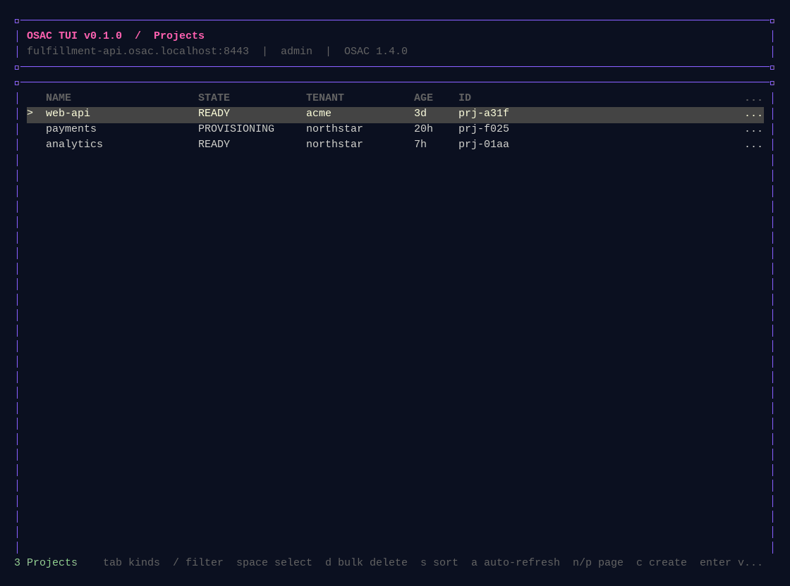

# osac-tui

`osac-tui` is a terminal UI for the OSAC fulfillment-service API. It is intended
to feel like `k9s` for fulfillment resources: pick a resource kind, inspect
objects as YAML, and use the same screen to create, update, refresh, or delete
them.



When `--address` or `--token` is omitted, the TUI opens a login modal. Enter a
kubeconfig path or leave the suggested path (or the field) as-is to use the
current kubectl configuration. The login flow discovers the fulfillment API
hostname from an Ingress, HTTPRoute, TLSRoute, or OpenShift Route in the
`osac` namespace and creates a short-lived token for the `admin` ServiceAccount
using `kubectl create token admin -n osac`. Set `OSAC_NAMESPACE` or
`OSAC_SERVICE_ACCOUNT` to override the defaults. The selected kubeconfig must be
allowed to create a token for that ServiceAccount. The discovered endpoint uses
port `443` by default, or `8443` for `.osac.localhost` hosts; set
`OSAC_GATEWAY_PORT` to override it.

## Download and install

Release binaries are published for Linux, macOS, and Windows. For Linux or
macOS, choose the release version and your platform:

```sh
VERSION=v0.1.0
OS=linux       # use darwin for macOS
ARCH=amd64     # use arm64 on Apple Silicon or ARM Linux
curl -fL "https://github.com/omer-vishlitzky/osac-tui/releases/download/${VERSION}/osac-tui_${VERSION}_${OS}_${ARCH}" -o osac-tui
chmod +x osac-tui
sudo install -m 0755 osac-tui /usr/local/bin/osac-tui
```

For Windows, download `osac-tui_${VERSION}_windows_amd64.exe` from the same
GitHub Release and place it on your `PATH`.

## Run

To connect directly, provide the gRPC address and bearer token:

```sh
go run ./cmd/osac-tui \
  --address fulfillment-api.example.com:443 \
  --tls \
  --token "$OSAC_TOKEN"
```

With no arguments, the TUI starts the interactive Kubernetes login flow:

```sh
go run ./cmd/osac-tui
```

Use `--ca-file` when the service certificate is signed by a private CA.
For development-only connections, `--insecure` skips TLS certificate verification.

### OpenShift cluster

The launcher below discovers the `fulfillment-api` route and cluster CA from
Kubernetes, then creates a short-lived token for the `admin` ServiceAccount in
the OSAC namespace. It requires `kubectl` and Go.

```sh
KUBECONFIG=/home/ovishlit/.kube/elkana.kubeconfig bash ./run-cluster.sh
```

Set `OSAC_SERVICE_ACCOUNT` to use another ServiceAccount. The token is held in
memory and the temporary CA file is removed when the TUI exits. Set
`OSAC_GATEWAY_PORT` if the route is exposed on a port other than `443`.

### Kind dev cluster

The dev cluster already has an accepted `TLSRoute` for
`fulfillment-api.osac.localhost` and exposes the Gateway on host port `8443`.
Run the helper below to use the kubeconfig at
`/home/rgolan/.kube/osac-dev-kind-root.kubeconfig` and start the TUI with the
cluster CA and dev user token:

```sh
bash ./run-kind.sh
```

Set `OSAC_USER` to use another seeded user, or set `OSAC_TOKEN` to skip the
Keycloak token request. Override `OSAC_GATEWAY_PORT` if the Gateway is exposed
on another host port.

## Keys

| Key | Action |
| --- | --- |
| `tab` | Search and choose a resource kind; type to filter, arrows to cycle, `enter` to select |
| `:` | Open resource command mode; type a prefix, `tab` to complete, arrows to cycle |
| `?` | Show the command and key reference |
| `j`/`k`, arrows | Move through rows or resource kinds |
| `/` | Enter a CEL filter for the current resource |
| `s` | Cycle sort field and direction |
| `n`/`p` | Next or previous page |
| `a` | Toggle 1-second auto-refresh (enabled by default) |
| `enter` | Open the selected object |
| `space` | Select or unselect the current row |
| `l` | Show related resources and navigate to one |
| `c` | Create an object with the system editor |
| `e` | Edit the selected object with the system editor |
| `y` | Copy the selected object's YAML to the clipboard |
| `d` | Delete the selected object |
| `r` | Refresh |
| `esc` | Go back or cancel |
| `q` | Quit |

The command palette also accepts `:help`, `:filter`, `:sort`, `:refresh`,
`:next`, `:previous`, and `:quit`.

Select multiple rows with `space`, then press `d` to bulk delete them.

The system editor is selected from `VISUAL`, then `EDITOR`, and falls back to
`vi`. Save and exit the editor to submit the complete protobuf object. Updates
use the object's `metadata.version` for optimistic locking.

Updates show a change review before submission; press `y` to submit or `n`/`esc`
to discard. If the server rejects a save, the editor reopens with the submitted
YAML and the error added as a comment. Common credential fields are redacted in
read-only YAML views.

On compute and bare-metal instance detail views, `c` opens the serial console.
Press `esc` to close it. VNC console support is not currently included.

Press `/` and enter a fuzzy search such as `te1`; matching characters may be
separated and are matched against the name, ID, tenant, and state. Press `s`
to cycle through name, state, tenant, and age ordering; `^` or `v` in the active
header shows the direction. Results are loaded in pages of 50 objects.

The header shows the connected address, authenticated user and organization,
TUI version, and OSAC version. Set `OSAC_VERSION` or pass `--osac-version` when
the API server version is known; the current public API does not expose it
directly.

## Scope

The client discovers every listable entity service in the public API. Full CRUD
services support create, update, and delete; read-only services such as catalog
and storage resources support listing and inspection only. Non-resource APIs
such as events and console streaming are not shown as resource kinds.
# osac-tui
